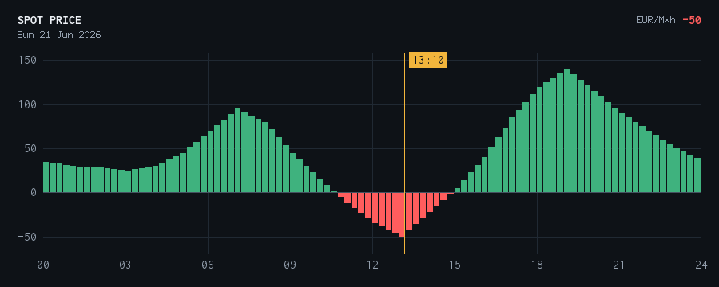

# grid-guard

[](https://github.com/hrubanj/grid-guard/actions/workflows/ci.yml)

A tiny, **stateless** cron-style Go binary that stops the Solax inverter from
selling to the grid while the OTE spot price is **≤ 0** (selling at a loss), and
posts a Telegram message — with a **day price chart** — whenever it switches.
Ships as a single **static `linux/amd64` binary** with no runtime dependencies on
the host.

Notification text is localizable: English (default) or Czech, via the `language`
config field — see [Configure](#configure). The chart image is always English/ASCII.

> ⚠️ **Disclaimer.** This is a personal hobby tool, provided **as-is, with no
> warranty, use at your own risk**. It is **not affiliated with, endorsed by, or
> supported by Solax Power or OTE**. It drives an inverter through Solax Cloud's
> private/undocumented control API and reads a third-party OTE price feed; either
> can change or break without notice. Automatically changing your inverter's
> grid-export configuration has real electrical-safety and grid-interconnection
> implications that vary by jurisdiction — you are responsible for ensuring such
> changes comply with your local grid-connection rules and distributor agreement.

## Example

When the spot price dips to or below the threshold, grid-guard stops export and
sends a Telegram message with a chart of the day's prices (green positive / red
negative bars, with a "now" marker):



> 🛑 **Stopping grid export**
> Spot price is dropping to **-50 EUR/MWh** (≤ 0) — we don't sell at a loss.
> ⏳ Negative-price window: **10:45–15:00**
> ▶️ Export resumes at **15:00**
> 🔋 Battery **96 %** · grid feed-in **0 W**
> 🕒 Jun 21, 2026 13:10

(The same message in Czech with `"language": "cs"`: *Zastavuji prodej do sítě …*)

## Logic

Every run (at each 15-minute price-segment boundary, +1s — see Deploy):

1. Fetch OTE 15-minute spot prices (`denni-trh` chart data, no auth).
2. `desired = forbid` if the minimum price over the next `lookahead_minutes`
   (default 5, kept below the 15-min segment) is ≤ 0 — i.e. the current segment.
3. Read the inverter's **actual** export setting (`EXPORT_CONTROL`).
4. If `desired != actual`: write the new setting (`0 W` to forbid, `15000 W` to
   allow) **and** send one Telegram message with a PNG chart of today's prices
   (green positive / red negative bars, "now" marker). Otherwise do nothing.

It is **stateless** — the inverter's own setting is the "previous state", so a
missed run, a failed write, or a manual change in the Solax app all self-heal on
the next run. The schedule fires 1 second past each 15-minute boundary
(:00:01/:15:01/:30:01/:45:01) so we act at the very start of each new price
segment; the small lookahead keeps the decision within the current segment.

```
prices (OTE) ─┐
              ├─► guard(now, +5min) ─► desired forbid/allow
clock ────────┘                              │
                                             ▼
inverter EXPORT_CONTROL (read) ─► actual ─► differ? ─► write + Telegram
```

## Build

Requires Go ≥ 1.26.

```bash
./deploy.sh build                         # -> bin/grid-guard (linux/amd64)
GOOS=linux GOARCH=arm64 ./deploy.sh build # Raspberry Pi etc.
```

The binary is static (`CGO_ENABLED=0`), stdlib-only (plus `golang.org/x/image`
for the chart), with tzdata embedded.

## Configure

Copy the example and fill in real values:

```bash
cp deploy/config.example.json config.local.json   # gitignored
```

| Field | Notes |
|-------|-------|
| `solax.loginData.loginPayload.username` | Solax Cloud email |
| `solax.loginData.loginPayload.userpwd` | **MD5 hash** of the password (`printf '%s' 'PASS' \| md5sum`) — see note below |
| `solax.loginData.deviceLoginPayload` | `sn` (the WiFi/LAN dongle serial), `userType`, `userId`, `firmId` — see "Obtaining the Solax values" |
| `solax.paramsBasePayload` | `sn` (dongle serial), `inverterSn` (inverter serial), `num`, `deviceType` — see "Obtaining the Solax values" |
| `solax.monitoringToken` | Solax monitoring API token (Solax Cloud → API/monitoring settings) |
| `telegram.bot_token` / `chat_id` | BotFather token + channel/chat id |
| `threshold_eur_mwh` | default `0` (raise slightly to cover sell fees) |
| `lookahead_minutes` | keep below the 15-min segment so the decision reflects the current segment (default `5`) |
| `timezone` | IANA tz name driving OTE segment alignment and message/footer times (default `Europe/Prague`); tzdata is embedded, so the host need not have it |
| `language` | Telegram notification language: `en` (default) or `cs` |
| `allow_export_value` | export cap in **W** when selling is allowed (default `15000`); set this to **your inverter's rating** |
| `also_set_workmode` | also force SELF_USE/FEED_IN on switch (default `false`) |

> **Password (MD5).** Solax Cloud's login expects the password as an MD5 hash, not
> plaintext. Generate it with `printf '%s' 'YOUR_PASSWORD' | md5sum`. Note this is
> Solax's own scheme — MD5 is not a strong hash, so still treat `config.json` as a
> secret (mode `0600`, never commit it).

### Obtaining the Solax values

`username`/`userpwd` are your Solax Cloud login. The remaining identifiers
(`sn`, `inverterSn`, `userId`, `firmId`, `num`, `deviceType`, `monitoringToken`)
are the parameters the Solax Cloud / mobile app sends to its own backend. The
`sn` is the serial printed on your WiFi/LAN communication dongle, and `inverterSn`
is the serial on the inverter itself. The remaining account-scoped IDs and the
monitoring token are easiest to capture by observing the requests the official
Solax app/portal makes when you log in and open your inverter (e.g. via your
browser's network inspector, or by reading the app's local config). Fill them into
`config.local.json` and verify read-only with `go run . -config config.local.json state`
before letting the tool write anything.

## Test it safely (no surprises)

```bash
go run . -config config.local.json prices            # show price + desired decision (no inverter)
go run . -config config.local.json state             # read live inverter state (read-only)
go run . -config config.local.json -dry-run notify-test   # print both messages, send nothing
go run . -config config.local.json -dry-run -verbose run  # full logic, no writes/sends
```

Flip the switch manually (writes the inverter; no Telegram):

```bash
go run . -config config.local.json forbid            # set EXPORT_CONTROL=0
go run . -config config.local.json allow             # set EXPORT_CONTROL=15000
```

## Deploy (any systemd host)

It's a single static `linux` binary with **no runtime dependencies** on the host.
Build locally and push it to any SSH-reachable Linux host running systemd. Set
`DEPLOY_TARGET`/`DEPLOY_PATH` to **your** host — the script has no usable default
(don't run a bare `./deploy.sh push` and expect it to find a host):

```bash
DEPLOY_TARGET=user@host DEPLOY_PATH=/home/user/grid-guard ./deploy.sh push
# ARM host (e.g. Raspberry Pi, Ampere): prefix with GOARCH=arm64
```

`push` builds, scps the binary & units, and prints the remote install commands.
Run them: binary → `/usr/local/bin`, `config.json` → `/etc/grid-guard/` (mode
`0600`, your real secrets), the systemd units, and
`sudo systemctl enable --now grid-guard.timer`. The timer fires at each 15-minute
OTE segment boundary (+1s); a cron alternative is in `deploy/crontab.example`.

Once deployed, see [`DEPLOYMENT.md`](DEPLOYMENT.md) for the operations runbook
(access, redeploy, observe, field gotchas).

<details>
<summary><b>Example: a free-tier Oracle Cloud VM</b> (one provider among many)</summary>

Oracle's Always-Free tier is a convenient place to run this 24/7. Signup needs a
credit card for verification (Always-Free resources aren't charged).

1. **Generate a dedicated SSH key**:
   `ssh-keygen -t ed25519 -f ~/.ssh/grid-guard -N "" -C grid-guard`
2. **Console → Compute → Instances → Create instance**:
   - **Shape**: `VM.Standard.E2.1.Micro` (x86, *Always Free-eligible*) — pick the AD
     the form says supports it. (`VM.Standard.A1.Flex` ARM works too, but A1 capacity
     is often scarce; deploy it with `GOARCH=arm64`.)
   - **Image**: Oracle Linux 9 (login user `opc`).
   - **Networking**: create a new VCN + **public subnet**, enable **auto-assign public IPv4**.
   - **Add SSH keys** → *Paste public key* → `~/.ssh/grid-guard.pub`.
   - If A1 returns *"out of host capacity"*, switch to `VM.Standard.E2.1.Micro` and retry.
3. Add the instance's public IP to `~/.ssh/config` (see `DEPLOYMENT.md` for the
   full entry), then:
   `DEPLOY_TARGET=<your-host> DEPLOY_PATH=/home/opc/grid-guard ./deploy.sh push`,
   run the printed install steps, and enable the timer.

The VM's egress is open and SSH (22) ingress is allowed by default — no inbound
rules needed (the tool only makes outbound HTTPS calls).
</details>

## Commands

| Command | Inverter | Telegram |
|---------|----------|----------|
| `run` (default) | write on switch | on switch |
| `prices` | – | – |
| `state` | read | – |
| `forbid` / `allow` | write | – |
| `notify-test` | – | sends sample messages |

Global flags: `-config PATH` (or `$GRID_GUARD_CONFIG`), `-dry-run`, `-verbose`.

## License

[MIT](LICENSE) © Jiri Hruban. Provided as-is; see the disclaimer above.
